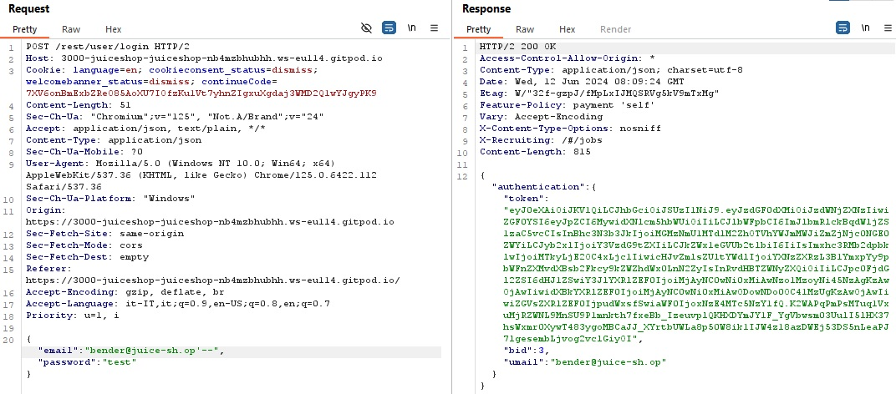

# Report on OWASP Juice Shop 

 

## Introduction

The **OWASP Juice Shop** is a web application that presents a wide number of vulnerabilities that are grouped in different categories, based on the type. 

The objective of the user is to exploit as many vulnerabilities as possible; in other words, to solve as many challenges as possible. 

In this report I explain how I managed to solve three challenges: 
1. Login with Bender’s account; 
2. Change Bender’s password into slurmCl4ssic; 
3. Exfiltrate the entire DB schema definition via SQL Injection. 

 

## Tools 

I ran the **OWASP Juice Shop** on the hosting provider **Gitpod**. 
To analyze the HTTP requests and responses I used **BURP**, a tool for web application security testing. The Burp’s tool “Repeater” was very useful, because it allowed me to modify HTTP requests and send them again. 
I also used the **Kali Linux** virtual machine to understand how sqlite3 worked, but I will not go into detail in this report. 

 

## Challenge 1 

The objective of this challenge is to login with another user account, in this case Bender.

In order to find Bender’s email address, it was necessary to discover the domain name. 

After logging in with my account (francesca@mail.com), I checked the calls on BURP. 

There was a GET request and the response was a JSON file, where there was the line: 

<pre>
"domain":"juice-sh.op"
</pre>

So, I could assume that the domain name is **juice-sh.op**.

  
_Figure 1: GET Request where there is the domain name_

At this point, I tried logging in with the email address “bender@juice-sh.op” and the password “test”. 

I got the message: “Invalid email or password.” 

I opened on BURP the HTTP POST request where the browser had sent the username and the password and I tried to see if there was a SQL injection vulnerability. 

To do this, using the BURP repeater, I modified the email field and I put: "bender@juice-sh.op’--"

The response was a 200 OK message, so I was able to login as Bender. 
In the response there was a token that I decoded in the website jwt.io. It contained several pieces of information about Bender’s account, including his email and the hashed password. 

_Figure 2: Successful Response_ 

I was able to login as Bender because of a **SQL injection vulnerability**: to exploit it, I found a parameter that the web application passed through a database and, by carefully embedding a SQL command into the content of the parameter, I tricked the web application into forwarding a malicious query to the database.

 

## Challenge 2 

The objective of this challenge is to change Bender’s password into slurmCl4ssic without using SQL Injection or Forgot Password. 

Because of the previous challenge, I knew how to login with Bender’s account by exploiting a vulnerability, so I did it by inserting “bender@juice-sh.op’--” in the email line and any password on the password line. 

I went to the “Privacy and Security” section and then to the “Change Password” section. 
I tried to change the password, but I got the error “401 Unauthorized” because “current password is not correct”; this was expected, because I do not know Bender's current password, since I was able to login with his account by exploiting an SQL injection vulnerability, and not by using his credentials.

By inspecting the HTTP calls of the Password Change on BURP, I noticed that this process happens through an HTTP GET call and that current and new passwords are submitted in clear text: 
<pre>
GET /rest/user/change-password?current=test&new=12345&repeat=12345 HTTP/2
</pre>

_Figure 3: Request with passwords in cleartext_

So, I tried to probe the responses on various inputs using the BURP repeater and, finally, I was able to change the password by submitting: 
<pre>
GET /rest/user/change-password?new=slurmCl4ssic&repeat=slurmCl4ssic HTTP/2
</pre>

_Figure 4: Successful HTTP Request_ 

So, I was able to change Bender's password without knowing his current one. 

 

## Challenge 3 

The objective of this challenge is to exfiltrate the entire DB schema definition via SQL Injection. 

The web application is a store that sells a variety of products, so there must be a database behind the catalog. 

To learn more about the DB schema, I decided to analyze the HTTP requests and responses on Burp. 
In order to do this, I searched several products through the search command on the site: I first search “banana juice” and then “apple’” (the website returned No Results Found). 
On Burp I notices that there are only two requests regarding these two operations: 

<pre>
GET /rest/products/search?q= HTTP/2
</pre>
The browser returns as a response a JSON file with all the products that are present 
on the shop. 

<pre>
GET /api/Quantitys/ HTTP/2
</pre>
The browser returns a response as a JSON file with the quantity of each product present in the shop. 

I sent the first request to the repeater to observe how the browser responds to requests with different values of the q parameter. 

By changing the request to 
<pre>
GET /rest/products/search?q=banana HTTP/2
</pre>
the HTTP response is: 

By changing the request to
<pre>
GET /rest/products/search?q=banana’ HTTP/2
</pre> 
the HTTP response is: 

From this error message, it is obvious that the database behind the shop is a SQLITE database. 

At this point, I visited the SQLITE website to learn more about the schema of the SQLITE database and I found out that the schema is stored in a system table called sqlite_master. 

I then used the Kali Linux machine, where sqlite3 was already installed, to understand better how certain queries worked. 

In order to find the schema of the database, it is possible to query from sqlite_master with the following query: 
<pre>
SELECT sql 
FROM sqlite_master;
</pre>

At this point, I went back to the Repeater’s tool in Burp and tried the known attacking pattern 
<pre>
‘))-- 
</pre> 
As expected, it worked. 

This means that the **/rest/products/search endpoint** is susceptible to SQL Injection into the q parameter. This is a SQL injection vulnerability that I exploited to solve the challenge. 

In order to exfiltrate the database schema, it was necessary to craft an attack payload which is a **UNION SELECT** merging the data from sqlite_master table into the products returned in the JSON result of the request. 

By injecting 
<pre>
banana')) UNION SELECT * FROM sqlite_master--
</pre> 
the HTTP Response contained a SQLITE error message saying: 
<pre>
"SQLITE_ERROR: SELECTs to the left and right of UNION do not have the same number of result columns"
</pre>

At this point, the objective was  to find the right number of columns.

I started with the following payload: 
<pre>
banana’))UNION SELECT '1' FROM sqlite_master-- 
</pre>

I obtained the same error as before. I went on until I didn’t have an error message anymore. 

Finally, with the payload: 
<pre>
banana'))UNION SELECT '1','2','3','4','5','6','7','8','9' FROM sqlite_master-- 
</pre>

I obtained the following response: 

With this message, I undesrsood that each product on the shop is described by nine attributes. 

By injecting the attack payload 
<pre>
qwert'))UNION SELECT sql '1','2','3','4','5','6','7','8','9' FROM sqlite_master-- 
</pre>
the browser finally returned the database schema and, consequently, led me to solve the challenge. 

## Bibliography 

To write this report and solve the challenges I refered to the companion guide of the application: https://pwning.owasp-juice.shop/companion-guide/latest/index.html 

I also consulted the SQLITE website (https://www.sqlite.org/index.html ) and, for understanding better how to do certain passages of the third challenge, I watched a video tutorial on Youtube (https://www.youtube.com/watch?v=0-D-e66U2Z0 )

